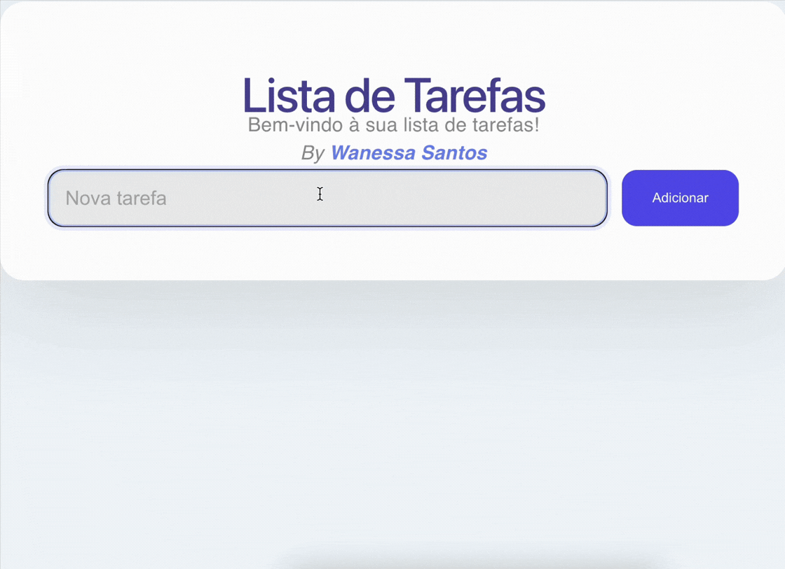

# ✅ Lista de Tarefas — React



## 📋 Sobre

Aplicação de lista de tarefas desenvolvida com React + Vite
- **Introdução a programação web**
- **Atividade**: A06 - Introdução ao React 

## ⚙️ Funcionalidades

- Adicionar tarefas
- Remover tarefas individualmente
- Validação para não adicionar tarefa vazia

## 🧠 Conceitos aplicados

- **JSX**: sintaxe que permite escrever HTML dentro do JavaScript
- **Componentes**: funções que retornam JSX e formam a interface
- **useState**: hook para gerenciar o estado da lista e do input

## 🚀 Como rodar localmente

```bash
npm install
npm run dev
```

## 🌐 Deploy

Acesse a aplicação: [http://localhost:5173](http://localhost:5173)
